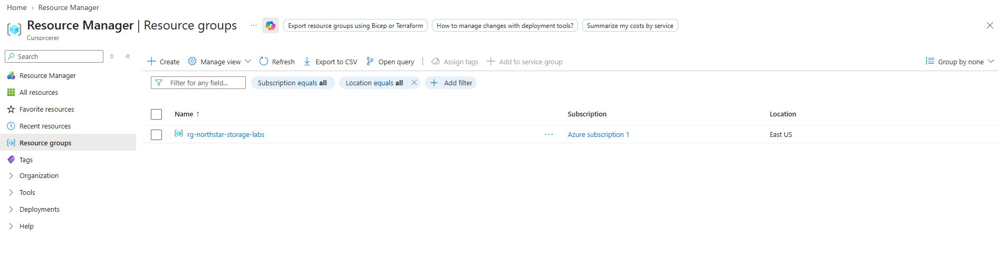
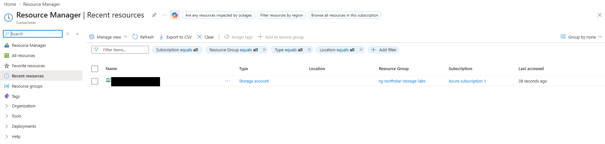
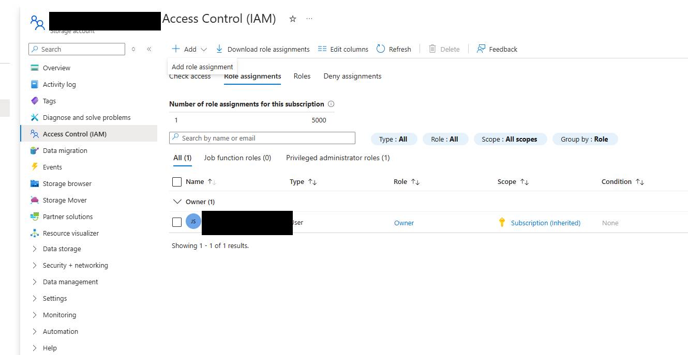
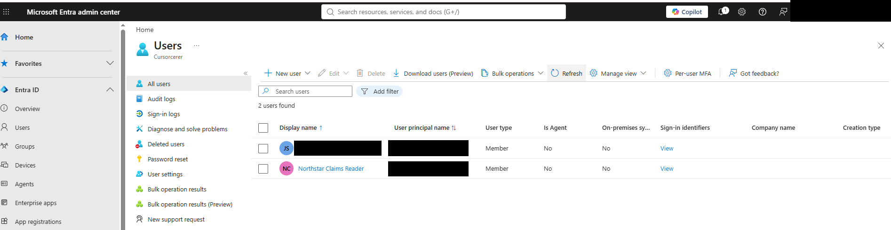
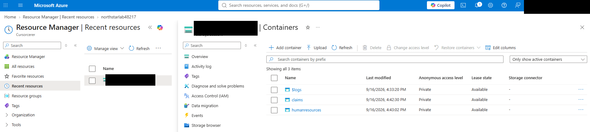
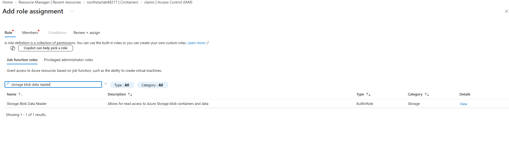
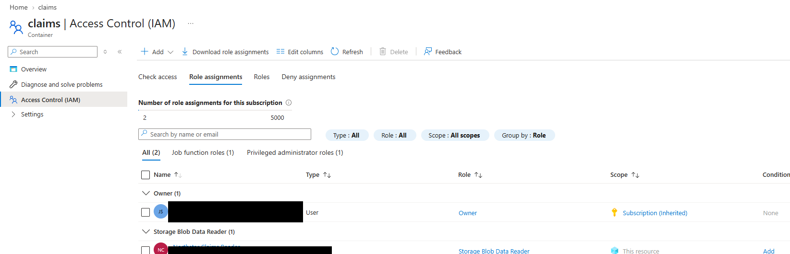
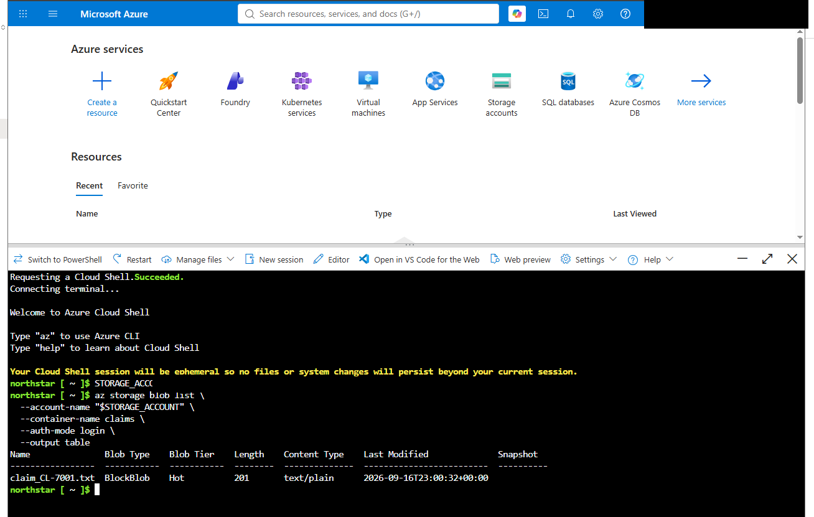
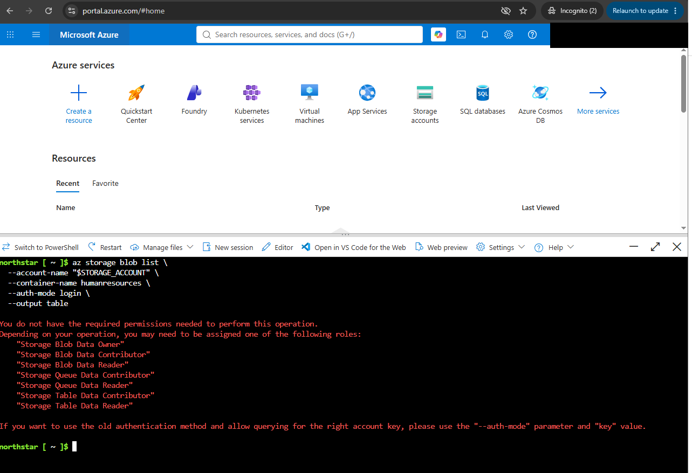

# Lab 00 — Building a Clean Azure RBAC Test

## What I wanted to prove

Before moving into the storage-security labs, I wanted a clean way to test Azure RBAC without my own admin permissions getting in the way.

My normal lab account is an Owner at the subscription level. That is useful for building the environment, but it makes it a bad identity for a least-privilege test because it already has broad access.

So I created a second Microsoft Entra user called **Northstar Claims Reader** and gave that account one job: read Blob data in the `claims` container.

I intentionally gave it no Blob data role on `humanresources`.

The result I wanted was simple:

```text
claims          -> allowed
humanresources  -> denied
```

That is exactly what happened.

## What I built

The lab environment uses:

- one Azure training resource group
- one Standard/LRS Storage account
- private `claims` and `humanresources` Blob containers
- a separate Microsoft Entra test user
- the built-in **Storage Blob Data Reader** role scoped only to `claims`
- two small synthetic text files so the access test had real objects to query

I used Azure Cloud Shell and forced Entra-based authentication with:

```bash
--auth-mode login
```

That was important because I wanted Azure to evaluate the test user's identity and RBAC permissions, not a Storage account key.

## What happened

| Test | Result | What it showed |
|---|---|---|
| List blobs in `claims` | Success | The test identity could see `claim_CL-7001.txt`. |
| List blobs in `humanresources` | Denied | The same identity did not have permission to read HR data. |

The denial was the expected result. It confirmed that the role assignment was actually scoped to the Claims container instead of the whole Storage account.

## A couple of things I ran into

I originally planned to call the HR container `hr`, but Azure Blob container names have a minimum length requirement. I changed it to `humanresources`.

I also made sure not to test with my normal Owner account. Because that access is inherited from the subscription, a successful HR read from that account would not tell me anything useful about the Claims-only role.

## Why this matters

This was a small lab, but the security idea is important: **a role name by itself is not enough. Scope matters.**

The same Entra identity was:

```text
allowed in one container
denied in another container
```

That is the behavior I would expect from a correctly scoped least-privilege design.

It also reinforced the difference between being able to manage an Azure resource and being authorized to read the data inside it.

## Evidence

All screenshots below were taken during the live lab. Personal identifiers, tenant details, object identifiers, and the live Storage account name were redacted where they were not needed to prove the result.

### Resource group created



### Training Storage account created



### Admin access inherited from the subscription



This is why I used a separate test identity for the RBAC validation.

### Restricted Entra test identity created



### Private Blob containers created



### Storage Blob Data Reader selected



### Role assignment confirmed at the Claims container



### Claims access succeeded



The restricted identity successfully listed the synthetic Claims blob using Entra authentication.

### Human Resources access was denied



The same identity was denied when it tried to list the `humanresources` container.

## Final result

**Lab 00: Complete**

The test proved the intended least-privilege behavior:

```text
Northstar Claims Reader
├── claims          -> ALLOWED
└── humanresources  -> DENIED
```

## Files in this lab

- `lab-guide.md` — full build and validation steps
- `cloud-shell-commands.md` — commands used for the access tests
- `results.md` — actual results from the completed lab
- `expected-access-matrix.csv` — expected RBAC behavior
- `synthetic-data/` — fake Claims and HR records used for testing
- `evidence/screenshots/` — sanitized screenshots from the live exercise

No production data, passwords, Storage account keys, SAS tokens, or live access tokens are included in this repository.
