# Lab 04 — Azure Data Lake Storage Gen2 Security

## Overview

I built this lab to get hands-on with access control in Azure Data Lake Storage Gen2.

The setup uses synthetic Claims and Human Resources data inside a small Data Lake. I used Microsoft Entra security groups, Azure RBAC, and Data Lake ACLs to create a simple least-privilege model and then tested it with two separate lab users.

The main test was straightforward:

- the Claims user should be able to read Claims and Shared data, but not HR data
- the HR user should be able to read HR and Shared data, but not Claims data

All data in this repository is synthetic. No real customer, employee, claim, salary, or production information is included.

## What I Built

```text
enterprise-data/
├── claims/
│   ├── claims_2026.csv
│   └── claims_summary.csv
├── human-resources/
│   ├── compensation.csv
│   └── employee_directory.csv
└── shared/
    └── department_codes.csv
```

The storage account was created with hierarchical namespace enabled so that I could work with Data Lake directories and POSIX-style ACLs.

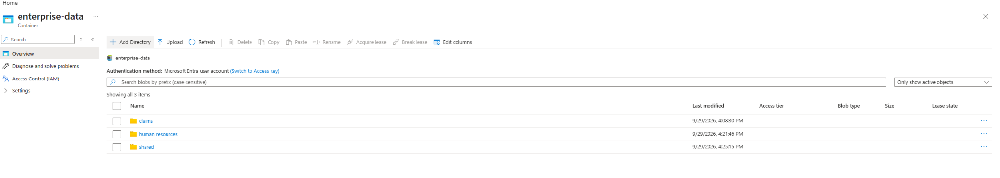

## Identity and Access Model

I created two Microsoft Entra security groups:

- `sg-adls-claims-analysts`
- `sg-adls-hr-analysts`

I also created one synthetic test user for each group.

The two groups received the normal Azure **Reader** role on the storage account so the test users could navigate to the resource in the Azure portal. I did not give either group a broad Blob data role at the storage-account level because that would have interfered with the directory-level ACL test.

My setup/admin account was used to build the environment and manage the ACLs. I did not use that account for the access tests.

## ACL Design

Both groups were given Read + Execute at the root of `enterprise-data`. That lets the users list the top-level directories and traverse the root path.

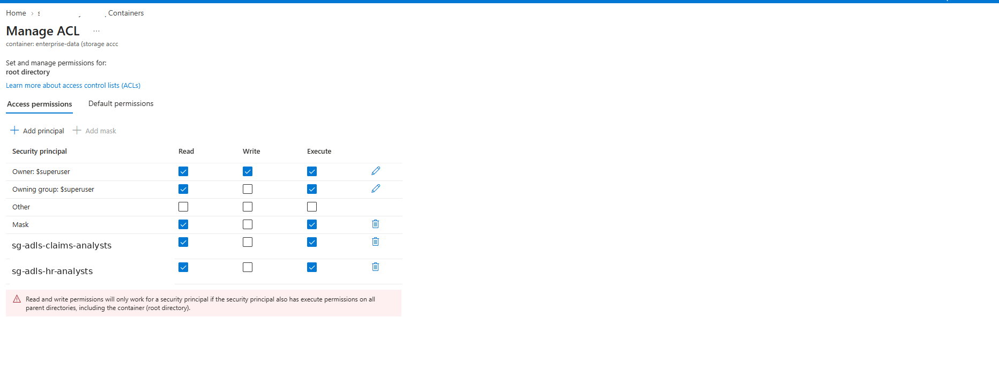

The departmental directories were then restricted separately.

### Claims

Only the Claims group received Read + Execute on `/claims`.

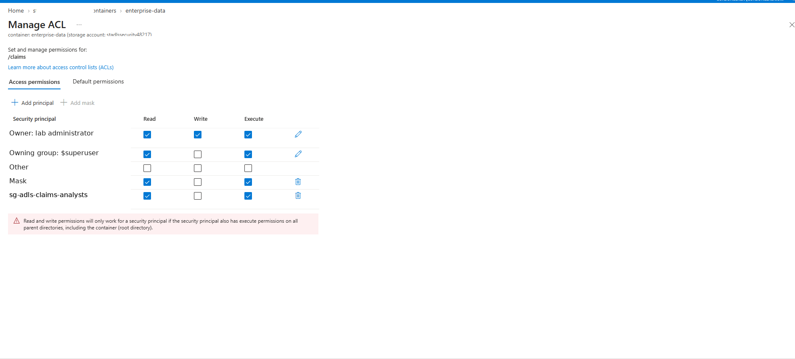

The existing CSV files inside the directory were given Read-only ACL entries for the Claims group.

### Human Resources

Only the HR group received Read + Execute on `/human-resources`.

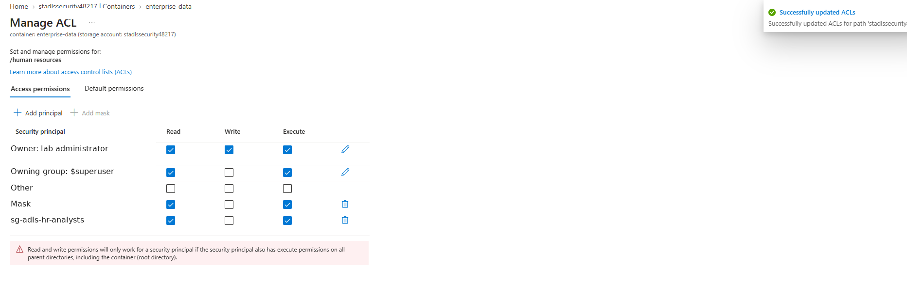

The existing HR CSV files were given Read-only ACL entries for the HR group.

### Shared

Both groups received Read + Execute on `/shared`, and both received Read-only access to `department_codes.csv`.

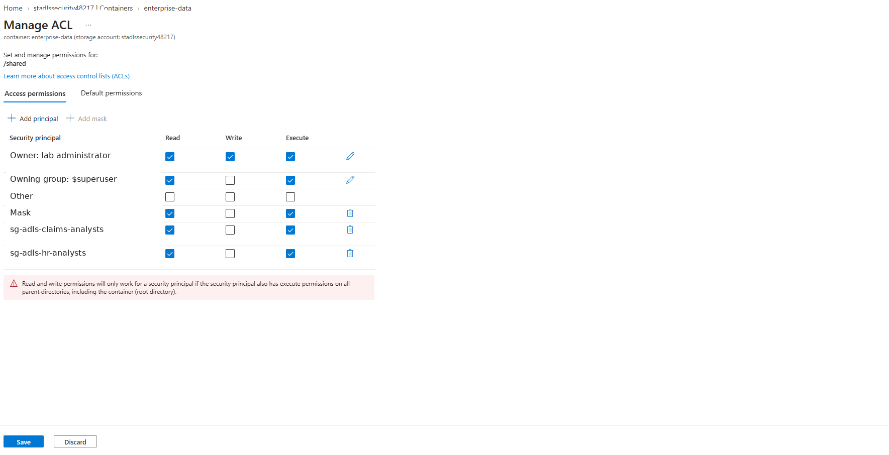

## Access Test Results

The final tests matched the intended access model.

| Test identity | Claims | Human Resources | Shared |
|---|---:|---:|---:|
| Claims Lab User | Allowed | Denied | Allowed |
| HR Lab User | Denied | Allowed | Allowed |

### Claims Lab User

Claims data was accessible:

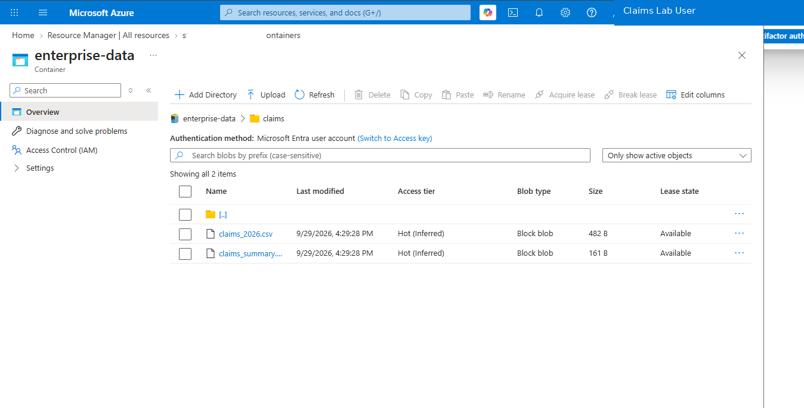

HR data was blocked:

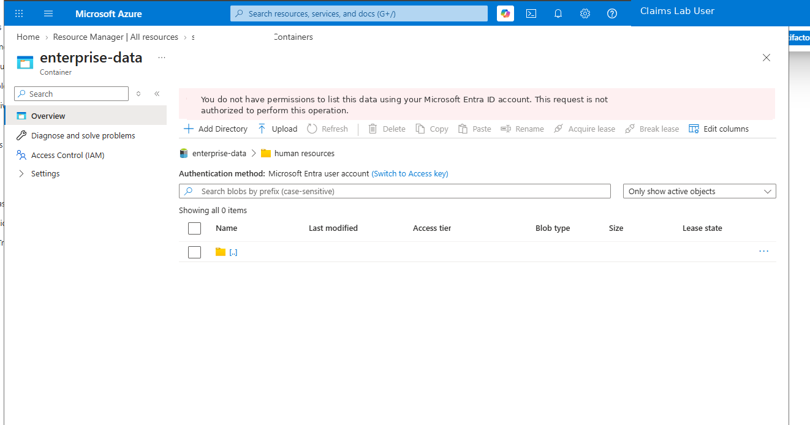

Shared data was accessible:

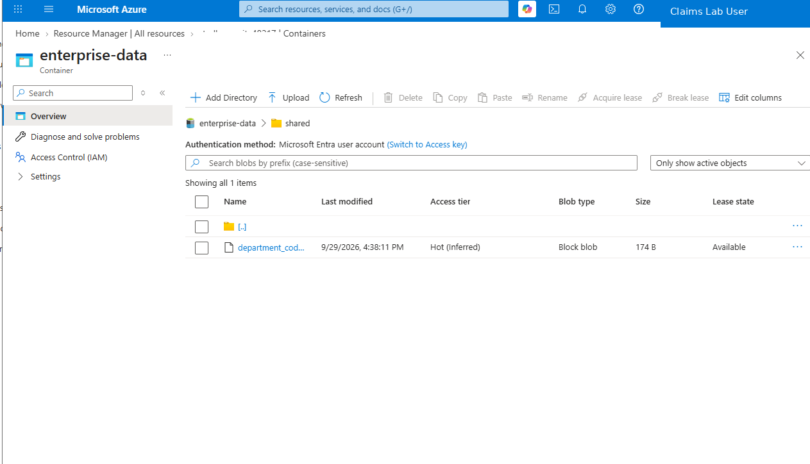

### HR Lab User

Claims data was blocked:

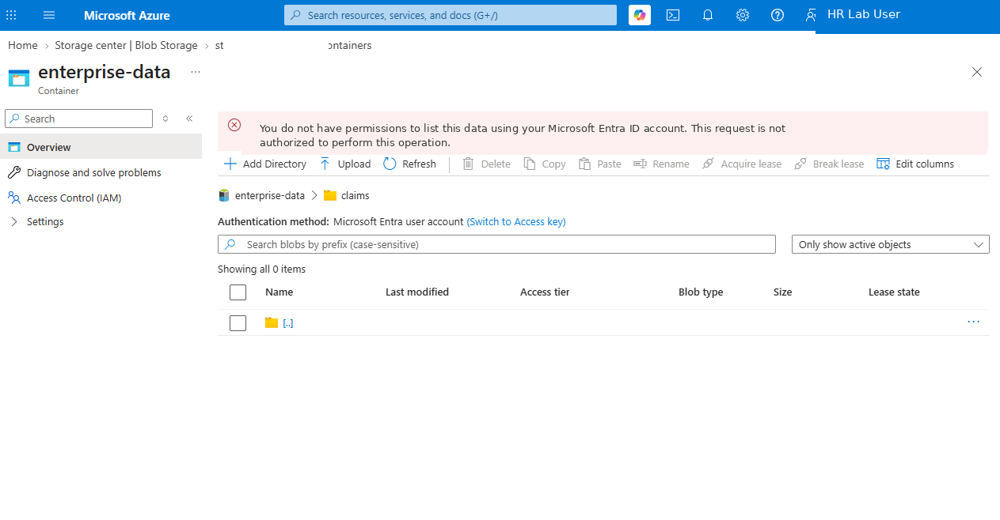

HR data was accessible:

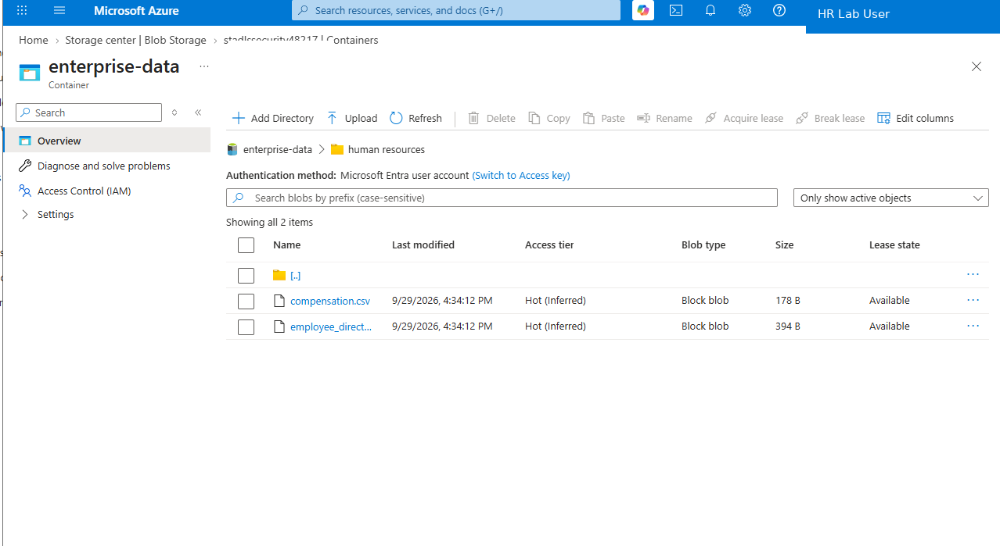

Shared data was accessible:

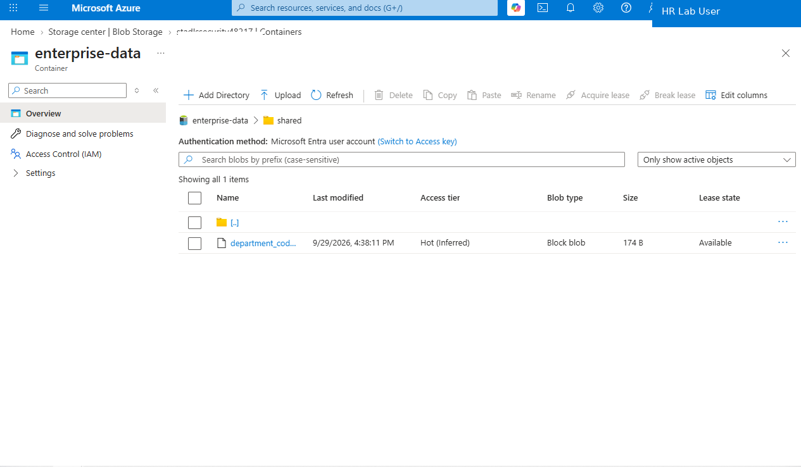

## Final Security Settings

After the identity and ACL tests were working, I reviewed the storage account configuration and hardened the final state.

The final lab settings included:

- hierarchical namespace enabled
- secure transfer required
- minimum TLS version set to 1.2
- anonymous blob access disabled
- Microsoft Entra authorization used for the portal
- storage account key access disabled after Entra-based access was validated
- locally redundant storage (LRS)
- public network access left enabled for this lab

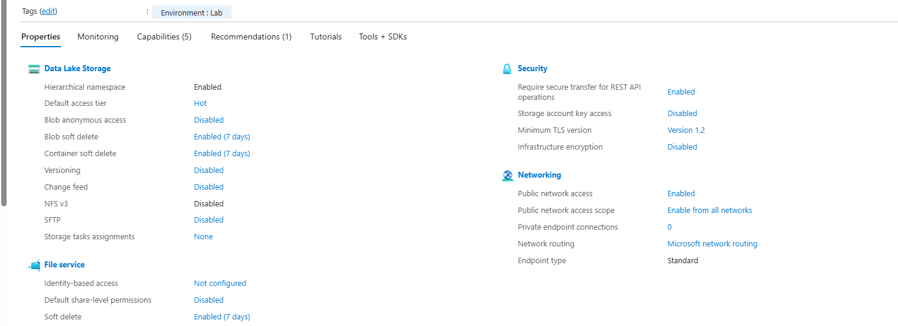

I intentionally left public network access enabled because the focus of this lab was identity, RBAC, and ACL behavior. In a production design I would normally evaluate selected networks, firewall rules, private endpoints, private DNS, centralized monitoring, and policy enforcement as additional controls.

## What I Learned

A few things stood out while building this:

- Azure management access and data access are separate. Being able to manage a storage resource does not automatically mean an identity can read the data inside it.
- Directory Execute permission matters. A user can have permission on a file or child directory and still be blocked if they cannot traverse the parent path.
- RBAC and ACLs need to be designed together. A broad data-plane RBAC assignment can make an ACL test meaningless because RBAC may already grant the data access.
- ACL changes on a directory do not automatically fix permissions on files that already existed, so I applied Read-only ACLs to the existing CSV files.
- Successful tests are only half of the validation. The denied Claims-to-HR and HR-to-Claims tests were important because they proved the boundaries were actually enforced.
- Once the Entra access path was working, I disabled storage account key access rather than leaving the shared master-key path available.

## Repository Contents

```text
.
├── README.md
├── data/
│   ├── claims_2026.csv
│   ├── claims_summary.csv
│   ├── compensation.csv
│   ├── department_codes.csv
│   └── employee_directory.csv
├── docs/
│   └── access-matrix.md
├── notes/
│   ├── access-test-results.md
│   └── lab-notes.md
└── screenshots/
    ├── 01-data-lake-directories.png
    ├── 02-root-acl.png
    ├── 03-claims-directory-acl.png
    ├── 04-hr-directory-acl.png
    ├── 05-shared-directory-acl.png
    ├── 06-claims-user-claims-allowed.png
    ├── 07-claims-user-hr-denied.png
    ├── 08-claims-user-shared-allowed.png
    ├── 09-hr-user-claims-denied.png
    ├── 10-hr-user-hr-allowed.png
    ├── 11-hr-user-shared-allowed.png
    └── 12-final-security-overview.png
```

## Notes on the Evidence

The screenshots in this repository were taken during the lab. Account-specific identifiers, tenant details, storage account identifiers, object IDs, request IDs, browser URLs, and personal account information were removed or cropped before publication.

The screenshots are meant to show the actual configuration and test results rather than every click used to build the environment.
